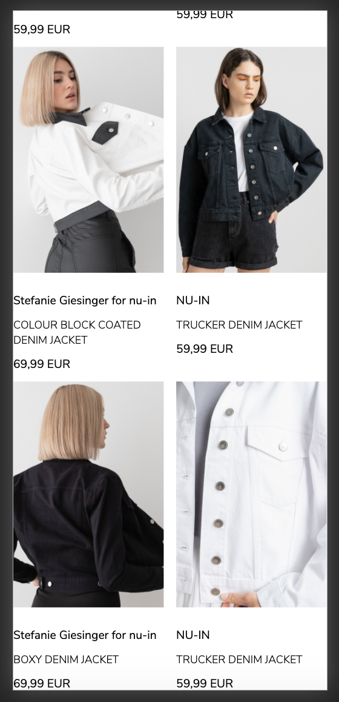
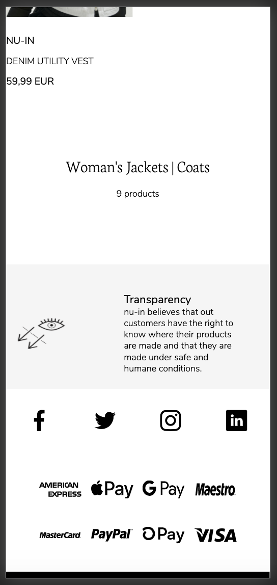
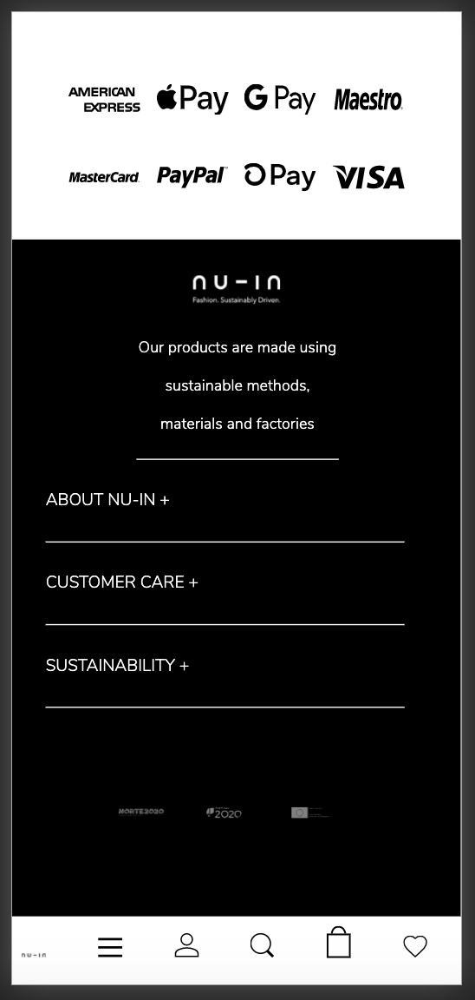
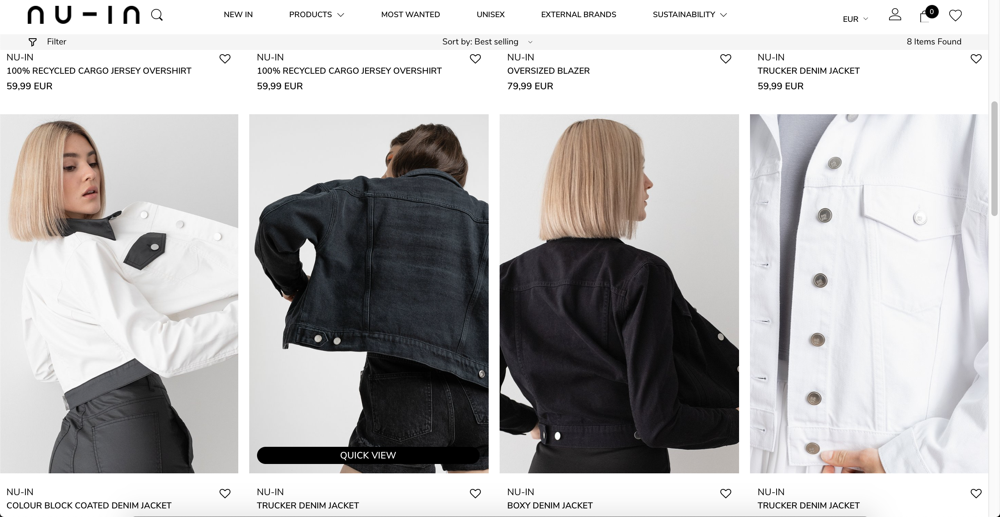
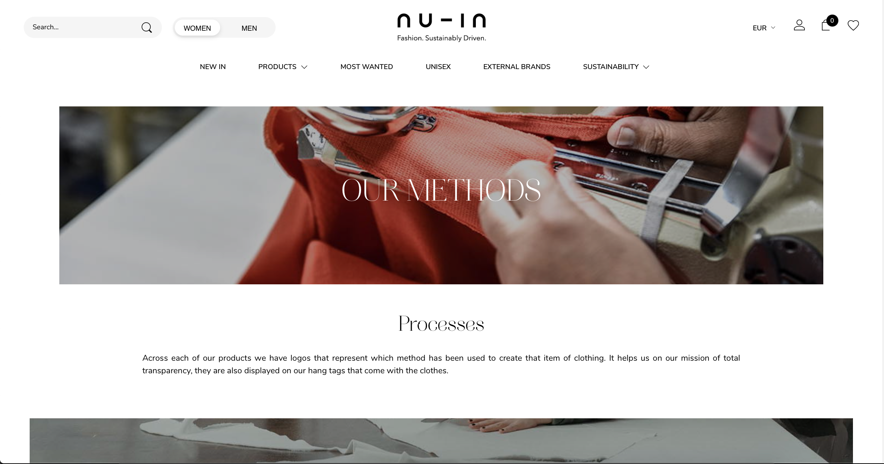
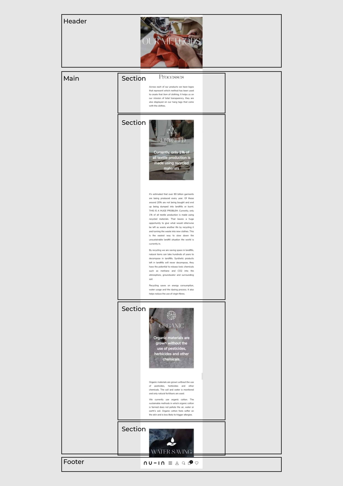
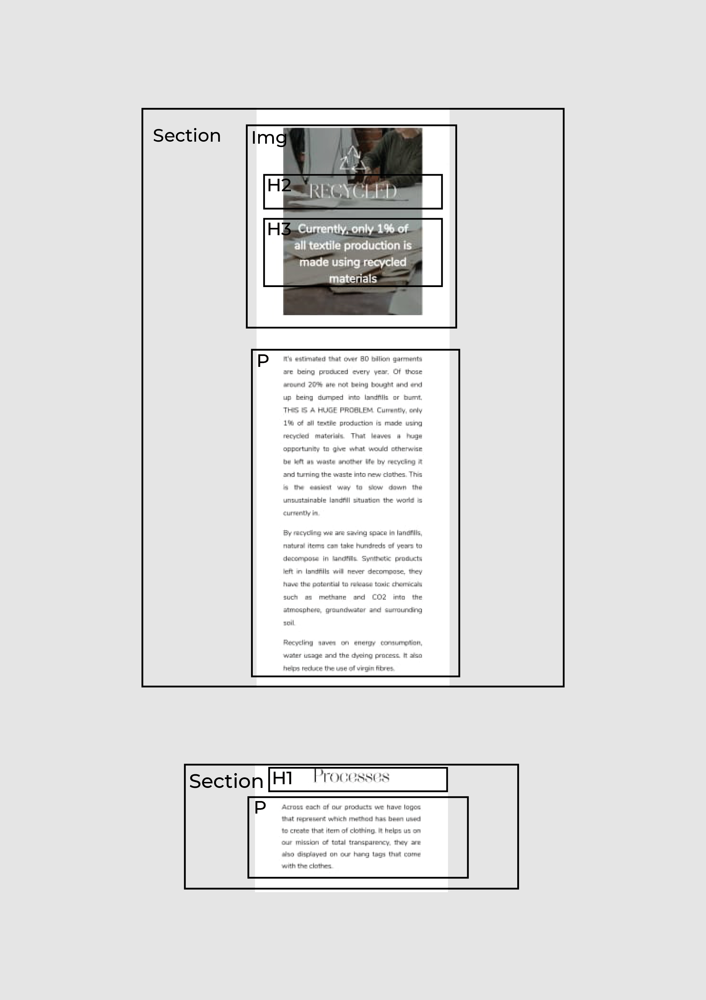

# Procesverslag
**Auteur:** Ysabella Vargas Reyes

## Bronnenlijst
1. https://nu-in.com
2. https://csspeeper.com (om de style mee in te zien)

## Eindgesprek (week 7/8)

-dit ging goed & dit was lastig-

**Screenshot(s):**

-screenshot(s) van je eindresultaat-

## Voortgang 3 (week 6)

-same as voortgang 1-

## Voortgang 2 (week 5)

-same as voortgang 1-

## Voortgang 1 (week 3)

### Stand van zaken

Ik vond het lastig om de oefeningen bij te houden naast de opdracht. Het lukte me wel om de stijl op te zetten van de website maar ik vond het lastiger om te werken met flexbox, sections en articles. Ik heb hier lang aan gezeten om het een beetje te begrijpen.

**Screenshot(s):**

Ik ben al ver met de productpagina van "jackets & coats". Er zijn nog kleine dingen waarvan ik even niet weet hoe ik doe moet oplossen. Dit zijn de navigatie en het save icoon waarmee je een product kan opslaan.

### Agenda voor meeting

Ik ben woensdag 16 september met een groepje studenten uit de klas aan dit vak gaan werken. Ieder deed zijn eigen ding maar bij vragen konden we bij elkaar terecht.

### Verslag van meeting

- Ik heb een goede opzet van mijn eerste pagina
- Twijfels of ik wel voor een responsive design moet gaan
- Ik begrijp het section:nth-of-type beter na hulp
- Werken met medestudenten werkt goed en motiverend

## Intake (week 1)

**Je startniveau:** -kies uit zwart, rood óf blauw-

Mijn startniveau zit op de "Rode piste". Ik vind coderen erg leuk als het lukt. Soms heb ik wat hulp nodig.

**Je focus:** -kies uit responsive óf surface plane-

Ik wil me focus leggen op het helemaal responsive maken van de website zodat er een duidelijk overzicht is voor zowel mobiel als web.

**Je opdracht:** -link naar de website die je gaat namaken óf de naam van je eigen ontwerp-

Ik ga de website: https://nu-in.com namaken. Ik houd hierbij de huisstijl aan en zal een aantal punten aan de lay-out veranderen omdat ik me wil richten op het responsive en toegankelijk maken van de website.

**Screenshot(s):**

**Breakdown-schets(en):**

