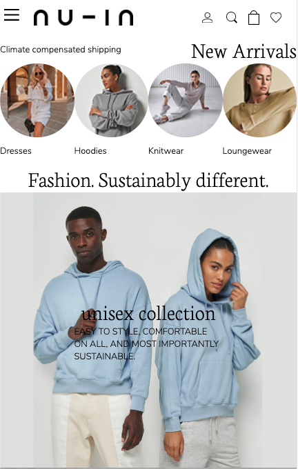

# Procesverslag
**Auteur:** Ysabella Vargas Reyes

## Bronnenlijst
1. https://nu-in.com
2. https://csspeeper.com (om de style mee in te zien)

## Eindgesprek (week 7/8)

De opstart van dit vak ging goed. Ik wist gauw welke website ik wilde gebruiken en kon hiermee aan de slag. Ik heb tijdens het vak veel online samengewerkt met medestudenten om elkaar te helpen en van elkaar te leren. Ook vond ik de hulp van de student assistent erg fijn. Als ik vastliep kwam ik hierdoor weer een stuk verder.

Ik vond het moeilijk om zonder classes te coderen maar naarmate de weken vorderden, kreeg ik door hoe ik ze niet meer/ tot weinig hoefde te gebruiken. Ook het gebruik van Javascript was niet altijd makkelijk maar heb ik toch zo begrijpelijk mogelijk voor mezelf kunnen maken.

Uiteindelijk heb ik alle errors uit mijn site gehaald, comments toegevoegd en gekeken welke code overbodig was.

### Wat goed ging:
- Het responsive maken van de site met media queries
- CSS selectoren gebruiken / nth-of-type etc.
- Flexbox (in de laatste twee weken kreeg ik het onder de knie)
- Begrijpen wanneer sections en articles gebruikt moesten
- Begrijpen wanneer een button of een A gebruikt moest worden
- CSSpeeper was onwijs handig om te stijl te zien van de originele website

### Dit vond ik lastig:
- De uiteindelijke keuze tussen surface plane of responsive
- De oefeningen van de les bijhouden naast de eindopdracht
- Flexbox gebruiken
- Javascript gebruiken

**Screenshot(s):**
Navigatie met een underline transition.

Hamburgermenu

Homepagina mobiel, de "new arrivals" foto's kunnen horizontaal gescrolld worden op mobiel en zijn klikbaar.

Product overzicht mobiel.

Product overzicht desktop.

Met een hover op een product veranderd de afbeelding en zie je een "quick view" button.

De "most wanted" producten kunnen horizontaal gescrolld worden op mobiel en desktop.

Op de homepagina is een nieuwsbrief form.

Automatische slider met informatie over hoe de producten worden gemaakt. Werkt op mobiel en desktop.

Responsive footer met iconen.

Uitklapbare footer voor mobiel en desktop.

## Voortgang 3 (week 6)

### Stand van zaken

Ik ben er tijdens de afgelopen week achter gekomen dat ik meer moeite heb met de code dan ik had gedacht. Ik probeer te doen wat ik kan en snap en krijg gelukkig ook hulp van medestudenten en Sam. Ik ben toch gegaan voor het responsive maken van mijn website. Vind het een uitdaging voor mezelf die ik zeker wil proberen.

**Screenshot(s):**

Zowel de productpagina als de homepagina is bijna af. Ik heb ervoor gezorgd dat het responsive is. Ik heb ook comments bij mijn code gezet en javascript toegepast omdat ik dit een uitdaging vind die ik graag wil doen. Met javascript heb ik wel hulp gekregen.

Mijn productpagina responsive met een hover met een button:

De footer is ook responsive:

### Agenda voor meeting

Ik ben woensdag 7 oktober samengewerkt met een groepje studenten uit de klas. Ik heb zelf een lijstje gemaakt met dingen die nog moeten gebeuren om mijn website foutloos te laten werken.

### Verslag van meeting

- Gebruik gemaakt van classes
- Javascript toegevoegd
- Ervoor gekozen de website responsive te maken

## Voortgang 2 (week 5)

### Stand van zaken

Ik vind het nog steeds lastig de gegeven oefeningen bij te houden naast de eindopdracht. Er gaat toch veel tijd in zitten. Ik begrijp de sections en articles steeds meer. Ik blijf nog twijfelen over het wel of niet responsive maken maar weet met wat inspanning dat het moet lukken.

**Screenshot(s):**

De productpagina is bijna af. Ik heb het (deels) responsive gemaakt en me code ook "opgeschoond". Ook heb ik een begin gemaakt aan mijn home pagina en een hamburgermenu toegevoegd.

Mijn productpagina responsive:

Het hamburgermenu:

Een begin van de homepagina:

Een carroussel op de homepagina:

### Agenda voor meeting

Ik ben woensdag 30 september en donderdag 1 oktober met een groepje studenten uit de klas bij elkaar gekomen om samen te werken en te bespreken wat nog moeilijk was. Ook deze week werkte ieder aan zijn eigen opdracht en konden we voor vragen bij elkaar komen.

### Verslag van meeting

- Mijn eerste pagina is bijna helemaal responsive
- Kies er toch voor het een en ander responsive te maken
- Ik heb gezien waar het beste een section of article kan gebruiken
- Met twee pagina's vind ik het moeilijk weinig classes te gebruiken

## Voortgang 1 (week 3)

### Stand van zaken

Ik vond het lastig om de oefeningen bij te houden naast de opdracht. Het lukte me wel om de stijl op te zetten van de website maar ik vond het lastiger om te werken met flexbox, sections en articles. Ik heb hier lang aan gezeten om het een beetje te begrijpen.

**Screenshot(s):**

Ik ben al ver met de productpagina van "jackets & coats". Er zijn nog kleine dingen waarvan ik even niet weet hoe ik doe moet oplossen. Dit zijn de navigatie en het save icoon waarmee je een product kan opslaan.

### Agenda voor meeting

Ik ben woensdag 16 september met een groepje studenten uit de klas aan dit vak gaan werken. Ieder deed zijn eigen ding maar bij vragen konden we bij elkaar terecht.

### Verslag van meeting

- Ik heb een goede opzet van mijn eerste pagina
- Twijfels of ik wel voor een responsive design moet gaan
- Ik begrijp het section:nth-of-type beter na hulp
- Werken met medestudenten werkt goed en motiverend
- Ik heb gemerkt dat de site het beste toont via "element inspecteren" en het dan op mobiel formaat zetten

## Intake (week 1)

**Je startniveau:** -kies uit zwart, rood óf blauw-

Mijn startniveau zit op de "Rode piste". Ik vind coderen erg leuk als het lukt. Soms heb ik wat hulp nodig.

**Je focus:** -kies uit responsive óf surface plane-

Ik wil me focus leggen op het helemaal responsive maken van de website zodat er een duidelijk overzicht is voor zowel mobiel als web.

**Je opdracht:** -link naar de website die je gaat namaken óf de naam van je eigen ontwerp-

Ik ga de website: https://nu-in.com namaken. Ik houd hierbij de huisstijl aan en zal een aantal punten aan de lay-out veranderen omdat ik me wil richten op het responsive en toegankelijk maken van de website.

**Screenshot(s):**

**Breakdown-schets(en):**

